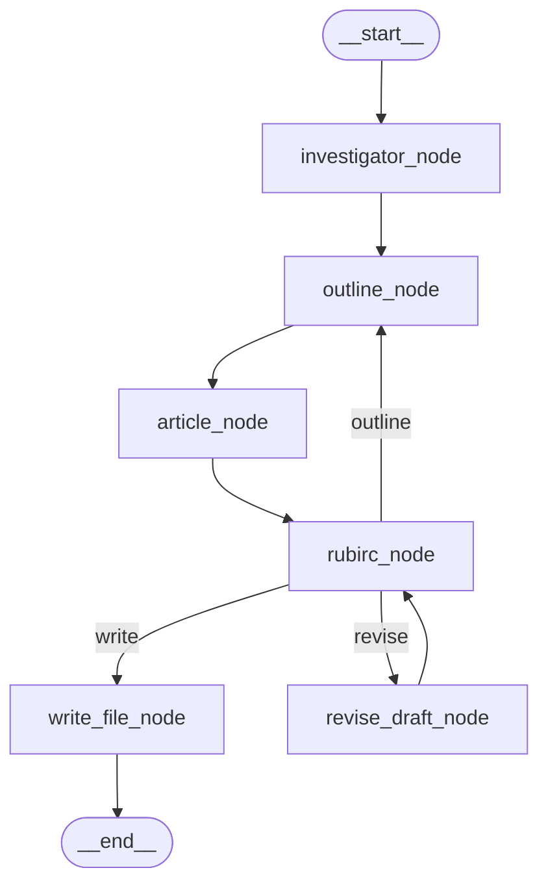

# ItIsAManager

Multi-Agent Personal Knowledge Manager (MPKN)

## What it is?

MPKN is a Multi-agent project based on  *LangChain*, that able to read the documents, notes, summarize the key points, and then generate new contests based on the summaries.

## Quick Start

1. Clone the project

1. Install `uv` or create a virtual environment via`-venv`

1. run the project via `uv run itisamaster` or `python main.py` the other case

## Workflow

The `main_agent_flow` receives the reuqest from the user like:

```
You are an expert article generation agent.
Now i need you to read the files at "documents/" then generate an article based on it
```

And a path `/documents`

Then creates and lanchs the `agent_graph`, the first node is the investigator_node, which list and decide which 5 (by default) files to read and then start some `llm_models` to read the `exact_content` of the file, and generate the `knowledge_chunk` based on the `exact_content` read by the `llm_models`.

After that comes to the `outline_node` where some `llm_models` will be started to generate `outline`, `chapter`s based on the `knowledge_chunk`s.

When `outline` is synthesized, serval other `llm_models` will be started to generate `final_draft` at the `generate_article_node`, then the `rubric_node` will starts to evaluate the article.

Based on the rubric result, the `rubric_conditional_branch` will lead the flow to `outline_node`, `write_node` or `revise_draft_node`



## Tech stack and Environment

- Python 3.13.5
- `LangChain`
- `LangGraph`
- LLM API
- Management via `uv`

## Project structure

```
src/agent_project/
├── schemas.py              # Pydantic dataformat
├── main.py                 # 
├── config/                 #
│   ├── settings.py         # Configuration of the project
│   └── logging_config.py   # Configuration of the log putput
├── tools/                  # Tools
│   ├── agent_tool.py       # Agentes' tool for varios operations
│   ├── utils.py            # Varios utilities
│   └── reader.py           # Varios file readers for distinct file formats
└── agent/                  # Agent
    └── agent.py            # 
```
