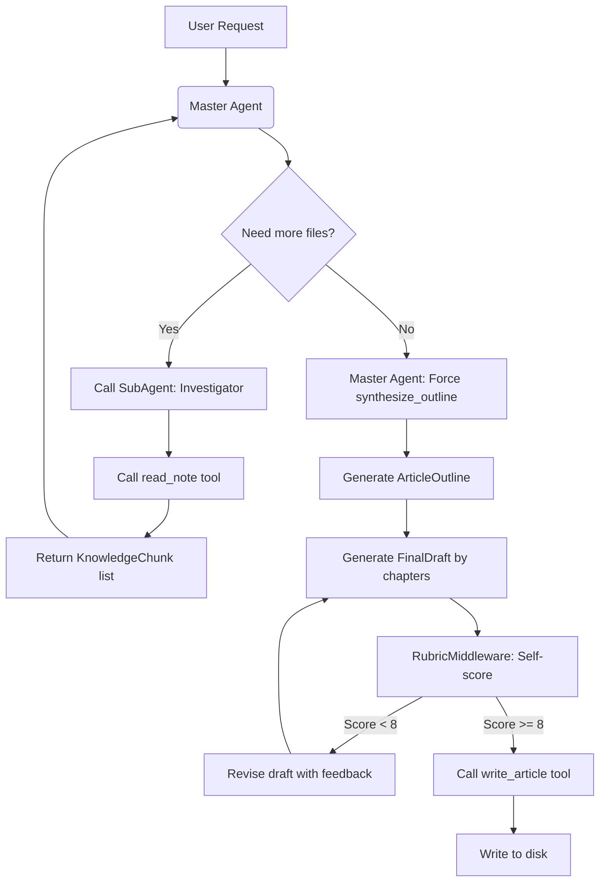

# ItIsAManager

Multi-Agent Personal Knowledge Manager (MPKN)

## What it is?

MPKN is a Multi-agent project based on  *LangChain*, that able to read the documents, notes, summarize the key points, and then generate new contests based on the summaries.

## Quick Start


## Workflow



## Tech stack and Environment

- Python 3.11+
- `LangChain` / `LangGraph` / `LangSmith`
- LLM API
- Management via `uv`

## Project structure

```
src/agent_project/
├── schemas.py              # Pydantic dataformat
├── main.py                 # 
├── config/                 #
│   ├── settings.py         # Configuration of the project
│   └── logging_config.py   # Configuration of the log putput
├── tools/                  # Tools
│   ├── agent_tool.py       # Agentes' tool for varios operations
│   ├── utils.py            # Varios utilities
│   └── reader.py           # Varios file readers for distinct file formats
└── agent/                  # Agent
```