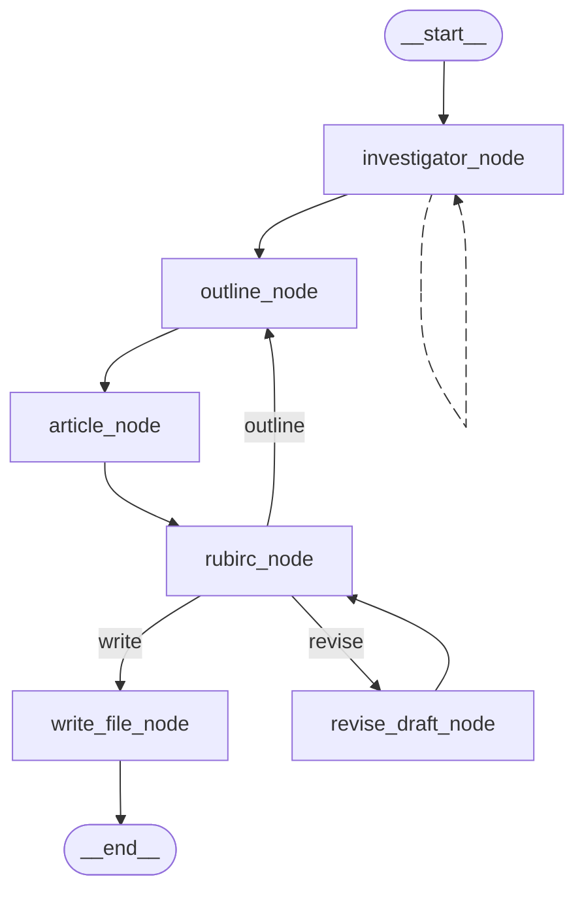

# ItIsAManager

Multi-Agent Personal Knowledge Manager (MPKN)

- custom state graph, deterministic workflow version at manual_state_graph branch
- ReAct and MCP version at react_mcp branch

## What it is?

MPKN is a Multi-agent project based on  *LangChain*, that able to read the documents, notes, summarize the key points, and then generate new contests based on the summaries.

## Quick Start

1. Clone the project

1. Install `uv` or create a virtual environment via`-venv`

1. run the project via `uv run itisamaster` or `python main.py` the other case

## Workflow

The `main_agent` receives the reuqest from the user like:

```
You are an expert article generation agent.
Now i need you to read the files at "documents/" then generate an article based on it
```

Then create a `sub_agent` as an investigator, which has the tool to `list` and `read` the files from the path give by the user, between them the `read` tool will start some `llm_models` to read the `exact_content` of the file, and generate the `knowledge_chunk` based on the `exact_content` read by the `llm_models`.

After that some other `llm_models` will be started to generate `outline`, `chapter`s based on the `knowledge_chunk`.

When `outline` is synthesized, serval other `llm_models` will be started to generate `final_draft`, then the `main_agent` will use its tool `write` to wirte down the article



## Tech stack and Environment

- Python 3.13.5
- `LangChain`
- `LangGraph`
- LLM API
- Management via `uv`

## Project structure

```
project-root/
├── pyproject.toml                      #
├── uv.lock                             # 
├── docker-compose.yml                  #
│
├── src/
│   └── itisamanager/                   # 
│       ├── pyproject.toml              # 
│       ├── Dockerfile                  # 
│       └── src/itisamanager/           # 
│           ├── __init__.py             #
│           ├── main.py                 #
│           ├── config/                 #
│           │   ├── settings.py         # settings
│           │   └── logging_config      # log configuration
│           ├── agent/
│           │   ├── supervisor.py       # supervisor graph
│           │   └── subgraphs/
│           │       ├── investigator.py # investigator subgraph
│           │       ├── synthesizer.py  # synthesizer subgraph
│           │       ├── reviewer.py     # reviewer subgraph
│           │       ├── generator.py    # generator subgraph
│           │       └── writer.py       # writer subgraph
│           └── tools/
│               ├── agent_tool.py       # tools of llm calling
│               ├── utils.py            # varios non-llm utilities
│               └── reader              # file reading utilities
│    
├── mcp-server/                         #
│   ├── pyproject.toml                  #
│   ├── Dockerfile                      #
│   └── src/mcp_server/
│       ├── __init__.py
│       ├── tools/                      # mcp tools
│       │   ├── io_tools.py             # I/O tools
│       │   └── reader.py               # auxiliar functions for io_tools.py
│       ├── config.py                   # mcp configuration
│       ├── main.py                     #
│       └── server.py                   # server
│
└── documents/                          #
```